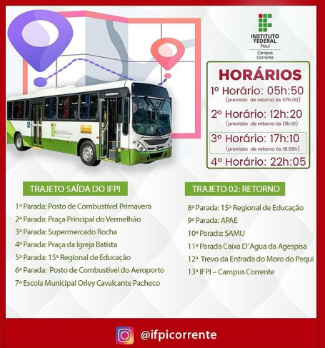
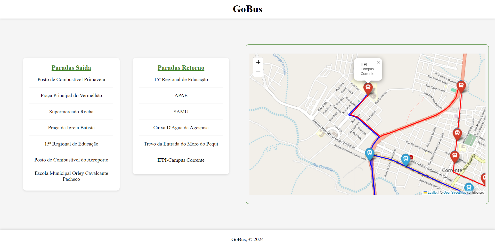

# GoBuss

**ATIVIDADE:** Criar a rota do ônibus do IFPI em um mapa com Folium, adicionando cada ponto de parada e colocando uma linha de cor azul na ida (ifpi aeroporto) e de cor vermelha na volta (aeroporto ao IFPI).

**ROTA**

**PREVIEW**

